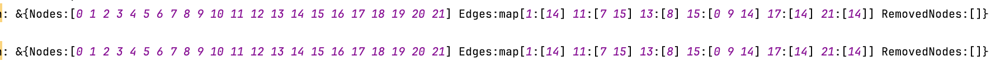
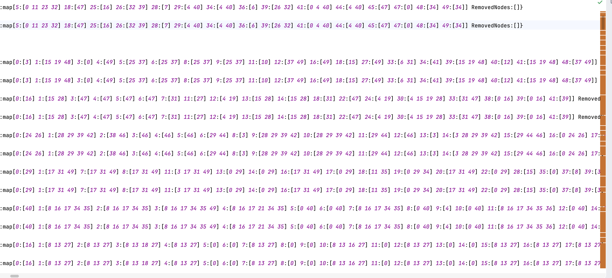
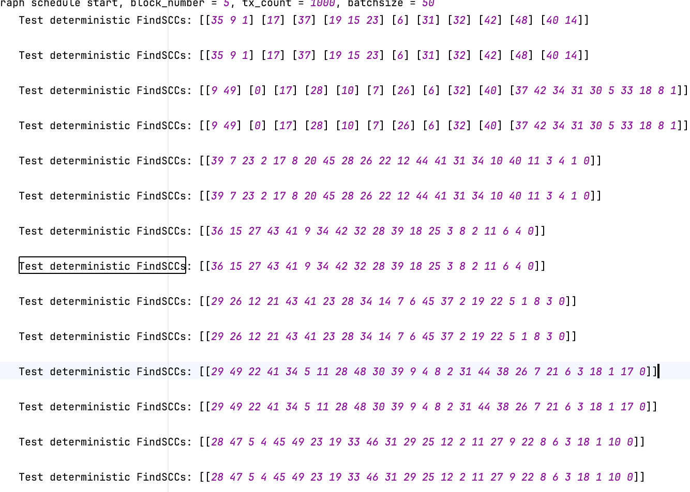
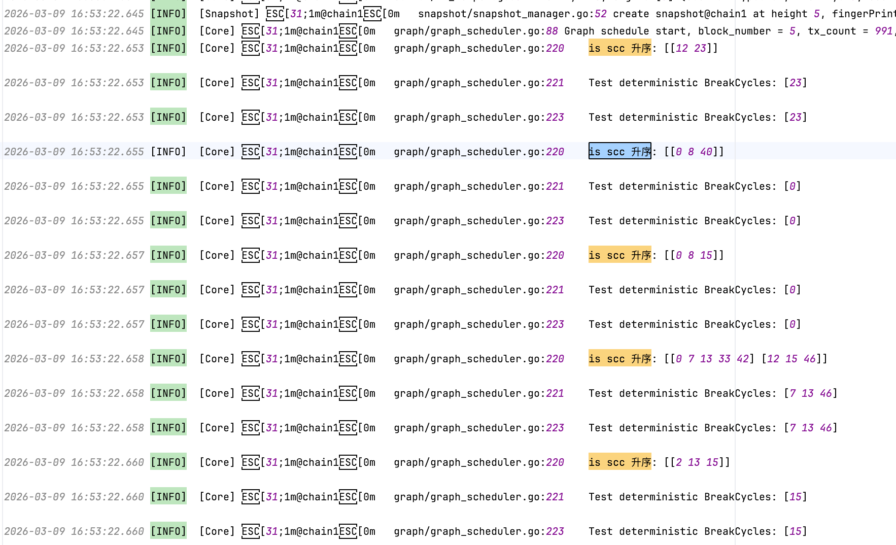
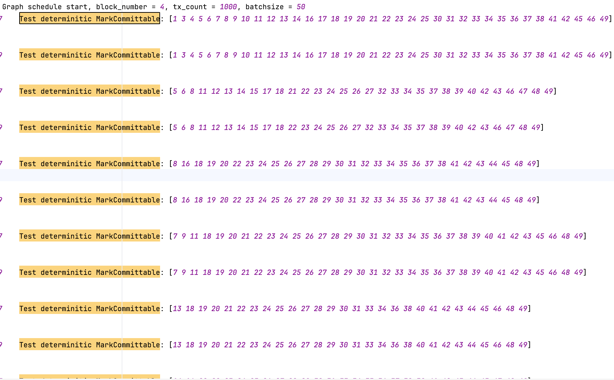

# MarkCommittable代码逻辑
好的，我来详细讲解 MarkCommittable_new 的代码逻辑。

  ---
整体目标

在一个交易依赖 DAG（有向无环图）中，将所有节点分为两类：
- 红色（red = 可提交 committable）：本轮可以安全提交的交易
- 灰色（gray = 不可提交
  uncommittable）：与已提交交易冲突，需要重新执行的交易

图的语义是：边 from → to 表示交易 from 读了交易 to 的写集，即
from 依赖 to。

  ---
算法流程（分层反向 BFS）

第 0 步：构建反向邻接表

reverseEdges[to] = []from   // 谁依赖了 to
为后续"从叶子向上反向传播"做准备。

第 1 步：初始层（红色层）

找到所有出度为 0 的节点（即没有依赖任何其他交易的节点），标记为
红色（可提交），作为第一个 BFS 层。

逻辑：没有任何依赖 → 执行结果不受其他交易影响 → 可以安全提交。

第 2 步：交替传播（核心循环）

使用 isRedLayer 标志位交替处理：

当前层是红色层 → 产出灰色层

对红色层中的每个节点 node：
对依赖 node 的每个未标记节点 from：
标记 from 为灰色（不可提交）

逻辑：如果你依赖了一个要被提交的交易（红色），说明你读了它的写
集 → 你和它存在读写冲突 → 你不能被提交，需要重新执行。

当前层是灰色层 → 产出红色层

对灰色层中的每个节点 node：
对依赖 node 的每个未标记节点 from：
检查 from 的所有出边（依赖）是否全部已标记（没有
unmarked 的）
如果是 → 标记 from 为红色（可提交）

逻辑：如果一个节点到现在还是
unmarked，说明它的依赖中从未出现过红色节点（否则它早就在上一轮
被标灰了）。所以它所有已标记的依赖一定都是灰色。如果此时它没有
unmarked 的依赖了，就意味着它的所有依赖都是灰色（不会被提交） →
不存在读写冲突 → 可以安全提交。

这也是代码注释中 "没有 unmarked 等价于所有依赖都是 gray" 的含义
—— 不是 bug。

第 3 步：收集结果

遍历所有节点，红色 → committable，灰色 → uncommittable。

  ---
用一个例子说明

假设依赖图为：
tx0 → tx2
tx1 → tx2
tx2 → tx3
（tx0 读了 tx2 的写，tx1 读了 tx2 的写，tx2 读了 tx3 的写）

┌───────┬────────┬──────────────────────────────┬──────────┐
│ 步骤  │ 层类型 │           处理内容           │   结果   │
├───────┼────────┼──────────────────────────────┼──────────┤
│ 初始  │ 红     │ tx3 出度为0                  │ tx3 → 红 │
├───────┼────────┼──────────────────────────────┼──────────┤
│ 第1轮 │ 红→灰  │ tx2 依赖 tx3(红)             │ tx2 → 灰 │
├───────┼────────┼──────────────────────────────┼──────────┤
│ 第2轮 │ 灰→红  │ tx0 依赖 tx2(灰)，无         │ tx0, tx1 │
│       │        │ unmarked 依赖；tx1 同理      │  → 红    │
└───────┴────────┴──────────────────────────────┴──────────┘

最终结果：
- committable = [tx0, tx1, tx3]
- uncommittable = [tx2]

含义：tx3 和 tx0、tx1 可以提交；tx2 因为和 tx3
冲突，需要重新执行。

  ---
需要注意的点 / 潜在风险

1. 前提假设：图必须是 DAG（无环）
   - 如果图中有环，环上的节点会永远保持 unmarked 状态（灰色层中
   onlygray 永远为 false），导致 markCount < len(g.Nodes) 永远成立
   → 死循环。
   - 代码的 TODO
   注释也提到了这一点："在确定能反向传播完整个图的前提上"。
   - 需要确保调用前已通过 DetectCycle + 破环处理消除了所有环。
2. 灰色层传播的"延迟标记"特性
   - 在灰色层处理时，一个 from 节点可能第一次被访问时还有
   unmarked 的依赖，所以被跳过。但当那些 unmarked
   依赖在后续轮次被标记后，from
   会通过那些新标记节点的反向边被再次访问。这不是
   bug，是正常的逐层收敛过程。
3. nextLayer 不会有重复
   - 虽然 nextLayer 用的是 slice 而非 map，但 mark[from] ==
   unmarked 这个检查保证了每个节点只会被标记和入队一次。

  ---
一句话总结

这是一个从叶子节点开始、交替标红标灰的反向 BFS
算法：没有依赖的交易可提交（红），依赖了可提交交易的不可提交（
灰），所有依赖都不可提交的反而可以提交（红），如此交替传播直到
所有节点都被标记。本质上是在 DAG 上按拓扑层次做冲突隔离。

# FindSCC 的确定性问题
module/core/common/scheduler/deterministic/graph/graph.go中的
FindSCCs是确定性的吗，即对于同样的图，多次运行得到的SCC都是那  
几个，内容都一样，只是顺序可能不同（即每个scc的内部和sccs之间  
进行的顺序）

⏺ Searched for 2 patterns, read 1 file (ctrl+o to expand)

⏺ Bash(ls /home/user/ 2>/dev/null || echo "no /home/user"; pwd;  
ls)                                                        
⎿  no /home/user                                               
/Users/denglongli/workspace/chainmaker-go                   
CLAUDE.md                                                 
… +20 lines (ctrl+o to expand)

⏺ Searched for 1 pattern, read 1 file (ctrl+o to expand)

⏺ 分析：FindSCCs 的确定性

结论：SCC 的内容（作为集合）是确定的，但顺序可能不同

分两种情况讨论：
                                                                 
---             
情况 1：对同一个 Graph 结构体多次调用 FindSCCs

完全确定，每次结果完全一致（包括顺序）。

FindSCCs 内部只遍历 slice，不遍历 map 的 key：
- 第 151 行遍历 g.Nodes — slice，顺序固定
- 第 183 行遍历 g.Edges[v] — 按 key 取出 slice 值，顺序固定
- t.visited[node] — 按 key 查 map 值，确定性操作

因此对同一个 Graph 实例，FindSCCs 是纯确定性的。

  ---
情况 2：图由 buildDependencyGraph 重新构建（相同输入）

SCC 的成员集合相同，但内部节点顺序和 SCC 之间的顺序可能不同。

原因在 buildDependencyGraph 的第 49-53 行：

        for readerIdx, writerSet := range edgeSet {
                for writerIdx := range writerSet {
                        graph.Edges[readerIdx] = append(graph.Edg
writerIdx)
}
}

这里 edgeSet 是 map[int]map[int]struct{}，Go 的 map
迭代顺序是不确定的。这导致 graph.Edges[readerIdx] 这个 slice
中邻居的排列顺序在不同运行中可能不同。

邻居顺序不同 → Tarjan DFS 遍历顺序不同 → SCC 内节点弹栈顺序不同
+ SCC 发现顺序不同。

但 SCC 的划分是图的拓扑属性（最大强连通子图），与遍历顺序无关，
所以作为集合是完全相同的。

  ---
总结

┌──────────────────────┬──────────────┬──────────┬──────────┐
│         场景         │     SCC      │   SCC    │   SCC    │
│                      │ 内容（集合） │ 内部顺序 │ 之间顺序 │
├──────────────────────┼──────────────┼──────────┼──────────┤
│ 同一 Graph           │   ✅ 相同    │ ✅ 相同  │ ✅ 相同  │
│ 实例多次调用         │              │          │          │
├──────────────────────┼──────────────┼──────────┼──────────┤
│ 相同输入重建图后调用 │   ✅ 相同    │   ❌     │   ❌     │
│                      │              │ 可能不同 │ 可能不同 │
└──────────────────────┴──────────────┴──────────┴──────────┘

如果需要在重建图后也保证完全确定性，只需在 buildDependencyGraph
第 49-53 行对 map 遍历结果排序即可。

# Test deterministic buildDependencyGraph
```go
// Test deterministic buildDependencyGraph
		Gs.log.Infof("Test deterministic buildDependencyGraph: %+v\n", graph)
		grap1 := buildDependencyGraph(execInfos, masterWS)
		Gs.log.Infof("Test deterministic buildDependencyGraph: %+v\n", grap1)
```



# Test deterministic FindSCCs
```go
// Test deterministic FindSCCs
			Gs.log.Infof("Test deterministic FindSCCs: %+v\n", sccs)
			sccs1 := graphCopy.FindSCCs()
			Gs.log.Infof("Test deterministic FindSCCs: %+v\n", sccs1)
```



# Test deterministic BreakCycles
```go
// Test deterministic BreakCycles
			Gs.log.Infof("is scc 升序: %+v\n", sccs)
			Gs.log.Infof("Test deterministic BreakCycles: %+v\n", removedNodes)
			removedNodes1 := graphCopy.BreakCycles(sccs)
			Gs.log.Infof("Test deterministic BreakCycles: %+v\n", removedNodes1)
```


# Test determinitic MarkCommittable
```go
// Test determinitic MarkCommittable
		Gs.log.Infof("Test determinitic MarkCommittable: %+v\n, %+v\n", committable, uncommittable)
		committable1, uncommittable1 := graph.MarkCommittable()
		Gs.log.Infof("Test determinitic MarkCommittable: %+v\n, %+v\n", committable1, uncommittable1)
```


```go
// Test determinitic MarkCommittable
		committable1, uncommittable1 := graph.MarkCommittable()
		if !reflect.DeepEqual(committable, committable1) ||
			!reflect.DeepEqual(uncommittable, uncommittable1) {
			Gs.log.Fatalf("MarkCommittable is NOT deterministic")
		}
```